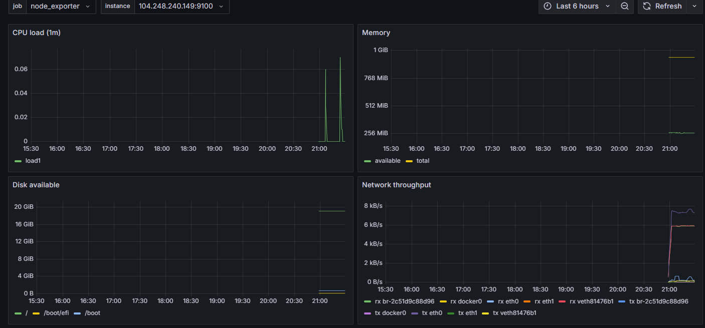
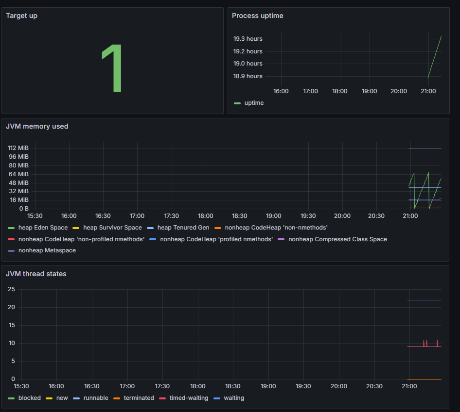
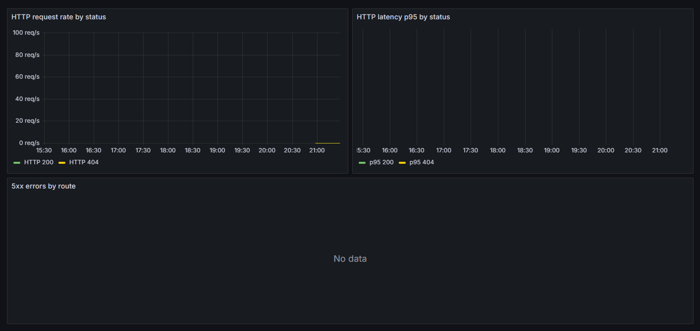
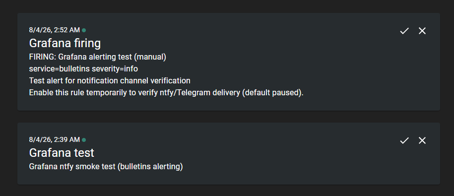

### Hexlet tests and linter status

[](https://github.com/Alex-tolch/devops-engineer-from-scratch-project-318/actions)

## Deploy (Hexlet)

Fork of [hexlet-components/project-devops-deploy](https://github.com/hexlet-components/project-devops-deploy) extended with **Terraform**, **Ansible**, monitoring, and **Docker** build. **Код приложения (`src/`, `frontend/`) не в этом репо** — при `make docker-build` / CI клонируется upstream (или свой fork через `APP_REPO`).

### Infrastructure reference (IPs, ports, URLs, notifications)

**Deployed lab (DigitalOcean):** app **`64.226.67.71`**, monitoring **`165.232.72.139`**. In playbooks use `inventory.ini` / `group_vars`, not these literals.

```bash
export APP_HOST=64.226.67.71
export MONITORING_HOST=165.232.72.139
# After a fresh terraform apply, outputs should match:
# APP_HOST="$(terraform -chdir=terraform output -raw droplet_ip)"
# MONITORING_HOST="$(terraform -chdir=terraform output -raw monitoring_ip)"
```

| Role       | Inventory group | Host IP          | Ports (host)                                                                                        | Public URL                                                                      |
| ---------- | --------------- | ---------------- | --------------------------------------------------------------------------------------------------- | ------------------------------------------------------------------------------- |
| App        | `[app]`         | `64.226.67.71`   | **8080** API, **9090** Actuator+Nginx (basic auth), **9100** node_exporter, **9113** nginx exporter | http://64.226.67.71:8080                                                        |
| Monitoring | `[monitoring]`  | `165.232.72.139` | **9090** Prometheus, **3000** Grafana, **3100** Loki (push from app `/32` only)                     | [Prometheus](http://165.232.72.139:9090), [Grafana](http://165.232.72.139:3000) |
| Local dev  | —               | —                | **8080**, **9090** Actuator                                                                         | http://localhost:8080                                                           |

Promtail on the app host pushes to `http://165.232.72.139:3100/loki/api/v1/push`.

**Grafana:** http://165.232.72.139:3000 — login `admin`, password `vault_grafana_admin_password` in encrypted vault. Dashboards: [System resources](http://165.232.72.139:3000/d/bulletins-system/system-resources), [Application health](http://165.232.72.139:3000/d/bulletins-app/application-health), [HTTP traffic](http://165.232.72.139:3000/d/bulletins-http/http-traffic), [Logs (Loki)](http://165.232.72.139:3000/d/bulletins-logs/logs-loki), [Status Page](http://165.232.72.139:3000/d/bulletins-status/status-page). Alerting: [rules](http://165.232.72.139:3000/alerting/list), [contact points](http://165.232.72.139:3000/alerting/notifications).

**Notifications:** primary channel **ntfy** — topic in `vault_grafana_ntfy_topic`, public subscribe URL `https://ntfy.sh/<topic>`, delivery path Grafana → `ntfy-relay` (monitoring Docker) → ntfy.sh. Test delivery: `make grafana-test-alert` or `GRAFANA_PASS='…' python3 scripts/ntfy_smoke_test.py`.

**Screenshots:** [`assets/grafana/`](assets/grafana/) and duplicate: [`__data__/assets/grafana/`](__data__/assets/grafana/).

**Secrets (Ansible Vault, `ansible/group_vars/app/vault.yml`):** `db_host`, `db_password`, Spaces keys, `vault_metrics_basic_auth_password`, `vault_grafana_admin_password`, `vault_grafana_ntfy_topic`; optional `vault_loki_push_*`. Template: [`vault.yml.example`](ansible/group_vars/app/vault.yml.example). Password file: copy [`ansible/.vault-password.example`](ansible/.vault-password.example) → `ansible/.vault-password`.

### Deploy from scratch (both VMs)

1. **Fork** this repository. Install **Terraform**, **Ansible**, **Docker**, **Make**, **Python 3**. App dev/tests — в [upstream](https://github.com/hexlet-components/project-devops-deploy).
2. **DigitalOcean:** create [API token](https://cloud.digitalocean.com/account/api/tokens) → `export DO_TOKEN=…`. Optional: Spaces keys if you use object storage in Terraform.
3. **SSH:** `ssh-keygen -t ed25519` (or RSA); register the public key in DO; private key path must match `ansible_ssh_private_key_file` in inventory (default `~/.ssh/id_rsa`).
4. **Terraform:** `cp terraform/terraform.tfvars.example terraform/terraform.tfvars` (if present) or set variables via env/`tfvars`; `make terraform-init && make terraform-apply`. Note `droplet_ip`, `monitoring_ip`, `database_password` from outputs.
5. **Managed Postgres (prod):** put `db_host` / `db_password` into vault; once per cluster run [`scripts/fix-do-postgres-schema.sql`](scripts/fix-do-postgres-schema.sql) as `doadmin` if the app fails with `permission denied for schema public`.
6. **Ansible inventory:** `cp ansible/inventory.ini.example ansible/inventory.ini` — IPs and `docker_image` (default `ghcr.io/<user>/devops-engineer-from-scratch-project-318:latest` from CI).
7. **Vault:** `cp ansible/group_vars/app/vault.yml.example ansible/group_vars/app/vault.yml`, fill secrets, `make ansible-vault-encrypt` (requires `ansible/.vault-password`).
8. **Image:** `make docker-build` (клонирует [project-devops-deploy](https://github.com/hexlet-components/project-devops-deploy)); CI push в GHCR на `main`. Свой fork приложения: `APP_REPO=https://github.com/<you>/project-devops-deploy.git make docker-build`. **Deploy:** `make deploy`. Private GHCR: `make docker-upload-server`.
9. **Verify:** `make ansible-lint` (no SSH), `make ansible-test` (ping), `export METRICS_PASS='…'` and `make smoke` (API, Prometheus, Grafana, optional Loki e2e). Manual: Grafana dashboards, `make grafana-test-alert`, confirm ntfy.

| Item          | Location                                                                                                                    |
| ------------- | --------------------------------------------------------------------------------------------------------------------------- |
| Ansible       | [`ansible/`](ansible/)                                                                                                      |
| Terraform     | [`terraform/`](terraform/)                                                                                                  |
| App URL       | http://64.226.67.71:8080                                                                                                    |
| Prometheus    | http://165.232.72.139:9090 ([`/graph`](http://165.232.72.139:9090/graph), [`/targets`](http://165.232.72.139:9090/targets)) |
| Grafana       | http://165.232.72.139:3000 (login `admin`, password in vault: `vault_grafana_admin_password`)                               |
| Lint / tests  | `make ansible-lint`, `make ansible-test`, `make smoke`, `make verify`                                                         |
| Alerting test | `make grafana-test-alert` (unpauses provisioned test rule ~2 min, then pauses again)                                        |

```bash
make docker-build
make ansible-lint
cp ansible/inventory.ini.example ansible/inventory.ini
make server-prepare && make server-deploy
make server-monitoring
make ansible-test && METRICS_PASS='…' make smoke
```

**Updating the app on the droplet:** after code changes — `make docker-build`, push to GHCR (CI on `main` or manual), then `make server-deploy`. If GHCR pull is denied:

```bash
make docker-upload-server
# or: NO_CACHE=1 make docker-upload-server
```

```bash
curl -s "http://64.226.67.71:8080/api/bulletins?page=1&perPage=3"
# Production metrics (Nginx basic auth; password in ansible vault):
curl -s -u "metrics:<password>" "http://64.226.67.71:9090/actuator/health"
curl -s -u "metrics:<password>" "http://64.226.67.71:9090/actuator/prometheus" | head
# Node Exporter (firewall: monitoring sources only; from allowed IP):
curl -s "http://64.226.67.71:9100/metrics" | head
```

## Observability (step 2): Node Exporter and application metrics

Ansible installs **Node Exporter** and an **Nginx** reverse proxy in front of Spring Actuator. The app publishes management on **`127.0.0.1:9091`** (container port 9090); Nginx listens on **`0.0.0.0:9090`** with **HTTP basic auth** and **JSON access/error logs** (`/var/log/nginx/metrics-access.json`, `metrics-error.log`). Host port 9090 cannot be shared with Docker `0.0.0.0`/`127.0.0.1:9090` bind — use 9091 for the container publish.

| Component                 | Port                     | Access                                                                                                                   |
| ------------------------- | ------------------------ | ------------------------------------------------------------------------------------------------------------------------ |
| HTTP API                  | 8080                     | Public (DO firewall)                                                                                                     |
| Actuator via Nginx        | 9090                     | `metrics_source_addresses` in Terraform + basic auth (`metrics` user, password in vault)                                 |
| Node Exporter             | 9100                     | `metrics_source_addresses` only (no auth; restrict by firewall)                                                          |
| Nginx stub_status         | 9090 path `/stub_status` | Same firewall as 9090 + IP allowlist in Nginx (`127.0.0.1`, monitoring `/32`); server uses `satisfy any` with basic auth |
| Nginx Prometheus Exporter | 9113                     | `metrics_source_addresses` only (scrapes stub_status locally)                                                            |

Terraform variable `metrics_source_addresses` (default **`null`** → only monitoring droplet `/32`) controls inbound **9090**, **9100**, and **9113** on the app host. Override in `terraform.tfvars` for lab-wide access:

```hcl
metrics_source_addresses = ["203.0.113.50/32"]
```

Inventory and vars: [`ansible/inventory.ini.example`](ansible/inventory.ini.example), [`ansible/group_vars/app/vars.yml`](ansible/group_vars/app/vars.yml). Add `vault_metrics_basic_auth_password` in encrypted [`ansible/group_vars/app/vault.yml`](ansible/group_vars/app/vault.yml) (see `vault.yml.example`).

Deploy monitoring stack:

```bash
make server-prepare          # first install
make ansible-monitoring      # after config changes
```

### Verification (app host `64.226.67.71`)

Local/docker (no Nginx, direct Actuator):

```bash
curl -s http://localhost:9090/actuator/health
curl -s http://localhost:9090/actuator/prometheus | head
```

Production (via Nginx on 9090):

```bash
export APP_HOST=64.226.67.71
export METRICS_PASS='your-vault-password'
curl -s -u "metrics:${METRICS_PASS}" "http://${APP_HOST}:9090/actuator/health"
curl -s -u "metrics:${METRICS_PASS}" "http://${APP_HOST}:9090/actuator/prometheus" | grep -E '^(process_uptime|http_server_requests)' | head
curl -s "http://${APP_HOST}:9100/metrics" | grep -E '^node_load1|^node_memory_MemAvailable_bytes' | head
```

### Required Prometheus metrics (host + application)

| Metric                                | Source                                | Category          |
| ------------------------------------- | ------------------------------------- | ----------------- |
| `node_load1`                          | Node Exporter                         | CPU load          |
| `node_cpu_seconds_total`              | Node Exporter                         | CPU               |
| `node_memory_MemAvailable_bytes`      | Node Exporter                         | Memory            |
| `node_memory_MemTotal_bytes`          | Node Exporter                         | Memory            |
| `node_filesystem_avail_bytes`         | Node Exporter                         | Disks             |
| `node_filesystem_size_bytes`          | Node Exporter                         | Disks             |
| `node_network_receive_bytes_total`    | Node Exporter                         | Network           |
| `node_network_transmit_bytes_total`   | Node Exporter                         | Network           |
| `node_procs_running`                  | Node Exporter                         | Processes         |
| `node_systemd_unit_state`             | Node Exporter (`--collector.systemd`) | System services   |
| `process_uptime_seconds`              | Actuator `/actuator/prometheus`       | JVM / app process |
| `jvm_memory_used_bytes`               | Actuator                              | JVM memory        |
| `http_server_requests_seconds_count`  | Actuator                              | HTTP traffic      |
| `http_server_requests_seconds_sum`    | Actuator                              | HTTP latency      |
| `http_server_requests_seconds_bucket` | Actuator                              | HTTP histogram    |

Collectors enabled in Ansible: `systemd`, `processes`. Application metrics use Micrometer Prometheus registry (Spring Boot Actuator).

## Observability (step 3): Prometheus server

A separate **monitoring** droplet (Terraform group equivalent: inventory `[monitoring]`) runs **Prometheus** via Ansible (`roles/prometheus`). Docker network **`monitoring`** isolates the stack for future Grafana / Alertmanager.

| Item                  | Location                                                                                                                    |
| --------------------- | --------------------------------------------------------------------------------------------------------------------------- |
| Monitoring VM         | `165.232.72.139` (`terraform output monitoring_ip`)                                                                         |
| Prometheus UI         | http://165.232.72.139:9090 — [`/graph`](http://165.232.72.139:9090/graph), [`/targets`](http://165.232.72.139:9090/targets) |
| Config (templated)    | `ansible/roles/prometheus/templates/prometheus.yml.j2`                                                                      |
| Alert rules           | `ansible/roles/prometheus/files/alerts.yml`                                                                                 |
| Scrape jobs / targets | `ansible/group_vars/monitoring/vars.yml`                                                                                    |

**Firewall:** app droplet **9090**, **9100**, and **9113** accept scrapes only from the monitoring droplet (`metrics_source_addresses = null` in Terraform → automatic `/32`). Monitoring droplet allows **22**, **9090** (`prometheus_ui_source_addresses`), and **3000** (`grafana_ui_source_addresses`).

### Provision and deploy

```bash
cd terraform && terraform apply
# Update ansible/inventory.ini with droplet_ip and monitoring_ip
make server-monitoring
```

Repeat deploy after config changes:

```bash
make server-monitoring
```

### Verification

1. Open **http://165.232.72.139:9090/targets** — jobs `node_exporter`, `bulletins_actuator`, and **`nginx`** should be **UP**.
2. In **http://165.232.72.139:9090/graph**, run PromQL **`up`** — all series should be **`1`**.
3. Optional:

```bash
export MONITORING_HOST=165.232.72.139
curl -s "http://${MONITORING_HOST}:9090/api/v1/query?query=up" | jq '.data.result[] | {job: .metric.job, instance: .metric.instance, value: .value[1]}'
```

Add future components by extending Ansible roles / `group_vars` — no manual edit of the rendered config on the server.

## Observability (step 4): Grafana

**Grafana** runs on the same monitoring droplet as Prometheus (`roles/grafana`), Docker network **`monitoring`**, port **3000**.

| Item                      | Location                                                                                        |
| ------------------------- | ----------------------------------------------------------------------------------------------- |
| Grafana UI                | http://165.232.72.139:3000                                                                      |
| Login                     | `admin` (see `vault_grafana_admin_password` in encrypted `ansible/group_vars/app/vault.yml`)    |
| Datasources (provisioned) | `datasources.yml.j2` — **Prometheus** + **Loki** (`http://loki:3100`)                           |
| Dashboards (provisioned)  | `ansible/roles/grafana/files/dashboards/*.json` — folder **Bulletins**                          |
| UI captures               | [`assets/grafana/`](assets/grafana/) and [`__data__/assets/grafana/`](__data__/assets/grafana/) |

Volumes on the host: `/opt/grafana/data`, `/opt/grafana/provisioning` (datasources + dashboard JSON).

### Deploy / update dashboards

```bash
make server-grafana          # Grafana only (after Docker exists on monitoring host)
make server-monitoring       # Prometheus + Grafana
```

### Dashboards

| Dashboard          | Variables                                  | Focus                                                                              |
| ------------------ | ------------------------------------------ | ---------------------------------------------------------------------------------- |
| System resources   | `$job`, `$instance`                        | CPU load, memory, disk, network (Node Exporter)                                    |
| Application health | `$job`, `$instance`                        | `up`, JVM memory, threads (Actuator)                                               |
| HTTP traffic       | `$job`, `$instance`, `$nginx_instance`     | Actuator HTTP + Nginx stub_status (RPS, status codes, latency, active connections) |
| Status Page        | —                                          | Service health; panels linked to alert rules                                       |
| Logs (Loki)        | `$job`, `$app`, `$env`, `$host`, `$search` | 5xx, latency, log stream, filter by client IP (`remote_addr`)                      |

Datasource **Loki** is on the Docker network `monitoring`; Grafana queries `http://loki:3100` (log-based alerts enabled).

Example dashboard captures:







## Observability (step 5): Grafana alerting

Unified alerting is **provisioned from the repository** (same `make server-grafana` as dashboards). Notifications use **ntfy**: Grafana sends a webhook to a small **`ntfy-relay`** container on the monitoring host, which posts **plain text** to `https://ntfy.sh/<topic>` (not raw JSON).

| Item                | Location                                                                       |
| ------------------- | ------------------------------------------------------------------------------ |
| Alert rules (YAML)  | `ansible/roles/grafana/templates/provisioning/alerting/rules.yml.j2`           |
| Contact point       | `ansible/roles/grafana/templates/provisioning/alerting/contactpoints.yml.j2`   |
| Notification policy | `ansible/roles/grafana/templates/provisioning/alerting/policies.yml.j2`        |
| Status dashboard    | `ansible/roles/grafana/files/dashboards/status-page.json` (`bulletins-status`) |
| ntfy topic (secret) | `vault_grafana_ntfy_topic` in `ansible/group_vars/app/vault.yml`               |
| ntfy relay          | `ansible/roles/grafana/files/ntfy-relay/app.py` (webhook → plain text)         |

Control test rule pause via Ansible var `grafana_test_alert_paused` (default `true` in `roles/grafana/defaults/main.yml`).

### Critical scenarios

| Alert                                | `for` | Labels                                   | Linked panel (Status Page) |
| ------------------------------------ | ----- | ---------------------------------------- | -------------------------- |
| Application scrape down              | 5m    | `severity=critical`, `service=bulletins` | Actuator stat              |
| Node exporter down                   | 5m    | `severity=critical`, `service=bulletins` | Node stat                  |
| High CPU load                        | 2m    | `severity=warning`                       | CPU load                   |
| Root disk almost full                | 2m    | `severity=warning`                       | Disk %                     |
| Elevated HTTP 5xx                    | 2m    | `severity=warning`                       | 5xx rate                   |
| Manual test rule (`bull-test-alert`) | 0s    | `severity=info`                          | — (paused by default)      |

Thresholds: `ansible/group_vars/monitoring/vars.yml` (`grafana_alert_*`).

1. **Alert rules:** http://165.232.72.139:3000/alerting/list
2. **Contact points:** http://165.232.72.139:3000/alerting/notifications
3. **Status Page:** http://165.232.72.139:3000/d/bulletins-status/status-page

### Deploy / sync rules

```bash
make server-grafana
```

### Test notifications

1. Subscribe to the ntfy topic: `https://ntfy.sh/<vault_grafana_ntfy_topic>` (in encrypted vault).
2. Optional channel check (direct ntfy, no Grafana): `curl -d "test" "https://ntfy.sh/<topic>"`
3. End-to-end (Grafana → `ntfy-relay` → ntfy): provisioned rule `bull-test-alert` stays paused (`grafana_test_alert_paused=true`); resume via Ansible, not the UI toggle on provisioned rules:

```bash
make grafana-test-alert
```

Expect a **plain-text** ntfy message. Optional helper (lists contact points + direct ntfy only): `GRAFANA_PASS='…' python3 scripts/ntfy_smoke_test.py`

In **Alerting → list**, **Grafana-managed** groups under **Bulletins** are in scope for this step. **Data source-managed** rules from Prometheus `alerts.yml` may show **No Data** — that is separate from Grafana alerting.



## Observability (step 6): Nginx Prometheus Exporter

The **metrics reverse proxy** Nginx (`roles/metrics_proxy`) exposes **`stub_status`** at **`/stub_status`** on port **9090** (same listener as Actuator). Access is limited by **Nginx `allow`** (`127.0.0.1` for the local exporter, monitoring droplet `/32`) and **HTTP basic auth** (`satisfy any`). **nginx-prometheus-exporter** (`roles/nginx_prometheus_exporter`, systemd) scrapes `http://127.0.0.1:9090/stub_status` and publishes Prometheus metrics on **9113**.

| Item                                         | Location                                                                                                                                              |
| -------------------------------------------- | ----------------------------------------------------------------------------------------------------------------------------------------------------- |
| Nginx site + stub_status                     | `ansible/roles/metrics_proxy/templates/metrics-proxy.conf.j2`                                                                                         |
| Exporter role                                | `ansible/roles/nginx_prometheus_exporter/`                                                                                                            |
| Prometheus job `nginx`                       | `ansible/group_vars/monitoring/vars.yml` → `prometheus_scrape_jobs`                                                                                   |
| Dashboard (RPS, codes, latency, connections) | [`http-traffic.json`](ansible/roles/grafana/files/dashboards/http-traffic.json) — [Grafana](http://165.232.72.139:3000/d/bulletins-http/http-traffic) |
| Grafana alert (5xx)                          | [Alert rules](http://165.232.72.139:3000/alerting/list) — _Elevated HTTP 5xx_ (`rules.yml.j2`)                                                        |

Versions: `nginx_exporter_version` in `roles/nginx_prometheus_exporter/defaults/main.yml` (exporter **1.4.2**), system **nginx** from Ubuntu packages.

### Deploy

```bash
make server-prepare          # app: stub_status + nginx-prometheus-exporter (tags setup)
make server-monitoring       # Prometheus scrape job + Grafana dashboard
```

After adding port **9113** in Terraform, apply firewall changes once:

```bash
cd terraform && terraform apply
```

### Verification

From a host allowed by the app firewall (monitoring droplet or your lab IP in `metrics_source_addresses`):

```bash
export APP_HOST=64.226.67.71
export METRICS_PASS='your-vault-password'
curl -s -u "metrics:${METRICS_PASS}" "http://${APP_HOST}:9090/stub_status"
curl -s "http://${APP_HOST}:9113/metrics" | grep -E '^nginx_(connections_active|http_requests_total)'
```

On Prometheus (**`job="nginx"`** UP):

```bash
export MONITORING_HOST=165.232.72.139
curl -s "http://${MONITORING_HOST}:9090/api/v1/query?query=nginx_connections_active" | jq '.data.result'
curl -s "http://${MONITORING_HOST}:9090/api/v1/query?query=rate(nginx_http_requests_total[5m])" | jq '.data.result'
```

`promtool check config` runs automatically in the Prometheus Ansible role after each deploy.

## Observability (step 7): Promtail + Loki

Centralized logs: **JSON stdout** from the Spring app (`logback-spring.xml`: `app`, `environment`, `instance`, `level`, `message`, MDC) and **JSON Nginx access** (`metrics-access.json`: `status`, `request_time`, `remote_addr`, …). **Promtail** on the app host (Docker) ships to **Loki** on monitoring (Docker + volume, network `monitoring`).

| Item      | Location                                                                                                                             |
| --------- | ------------------------------------------------------------------------------------------------------------------------------------ |
| Loki      | `ansible/roles/loki/` — `/opt/loki`, port **3100** on **165.232.72.139** (DO firewall: app **64.226.67.71/32** only)                 |
| Promtail  | `ansible/roles/promtail/` — `/opt/promtail`, `docker_sd_configs` + Nginx file scrape                                                 |
| Labels    | `job`, `env`, `app`, `host` (+ `status`, `remote_addr` from Nginx JSON pipeline)                                                     |
| Grafana   | Datasource `http://loki:3100`, dashboard [**Logs (Loki)**](http://165.232.72.139:3000/d/bulletins-logs/logs-loki) (`logs-loki.json`) |
| Log alert | _Nginx 5xx log rate elevated (Loki)_ in `rules.yml.j2`                                                                               |

Optional push auth (if enabled later): `vault_loki_push_username` / `vault_loki_push_password` in vault (referenced in `promtail-config.yml.j2`).

### Deploy

```bash
cd terraform && terraform apply   # opens :3100 on monitoring for app → Loki push
make server-prepare               # app: Promtail
make server-monitoring            # Loki + Grafana dashboards/alerts
```

### Verification

```bash
export APP_HOST=64.226.67.71
export MONITORING_HOST=165.232.72.139
export METRICS_PASS='…'   # vault_metrics_basic_auth_password
METRICS_PASS="$METRICS_PASS" python3 scripts/loki_smoke_test.py
```

Grafana → **Explore** → Loki:

```logql
{job="nginx-metrics"} | json | status >= 500
{job="bulletins-app"} | json | level="ERROR"
{job="nginx-metrics"} | json | remote_addr="<client-ip>"
```

Confirm application JSON shape (local or on server):

```bash
ssh root@$APP_HOST 'docker logs bulletins-app-1 2>&1 | tail -1 | jq .'
```

---

## Application image (source not in this repo)

| Item | Location |
|------|----------|
| App source | [hexlet-components/project-devops-deploy](https://github.com/hexlet-components/project-devops-deploy) only |
| Build | [`Dockerfile`](Dockerfile) clones `APP_REPO` at build; `make docker-build`; CI job **docker** → GHCR |
| Overrides | `APP_REPO`, `APP_REF` (Makefile / env) |
| On server | `ansible/roles/app` pulls `docker_image` from `group_vars/app/vars.yml` |
